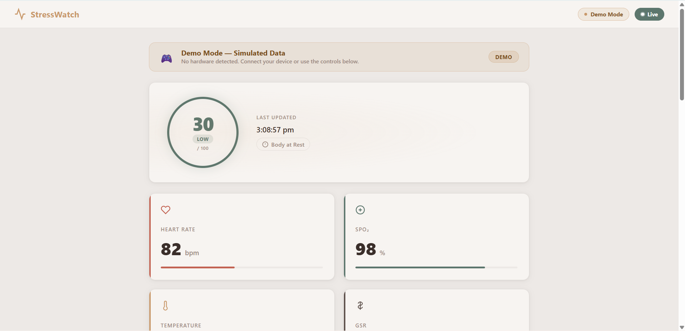
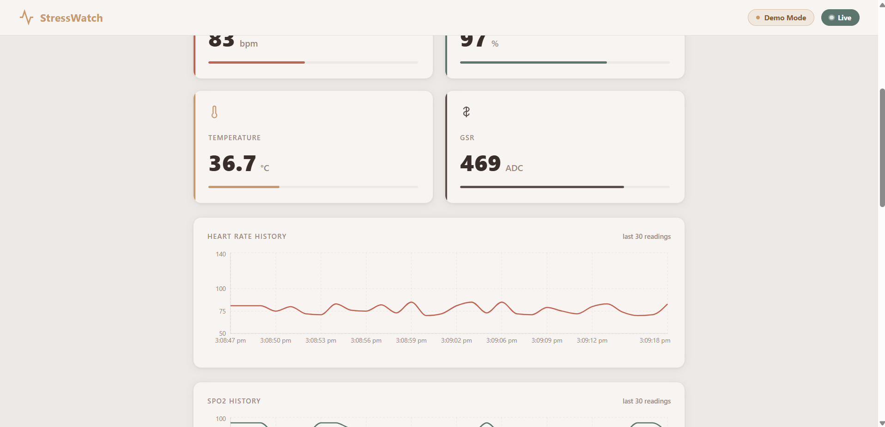
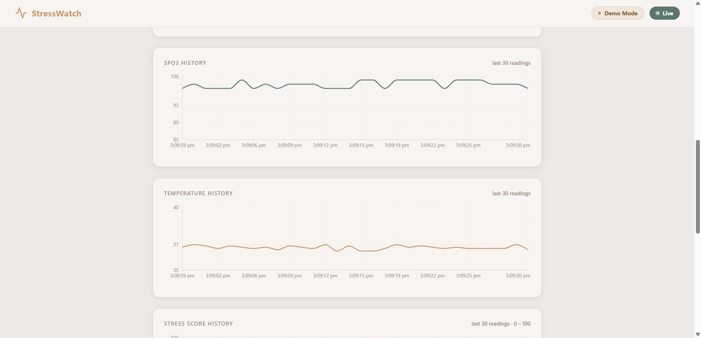
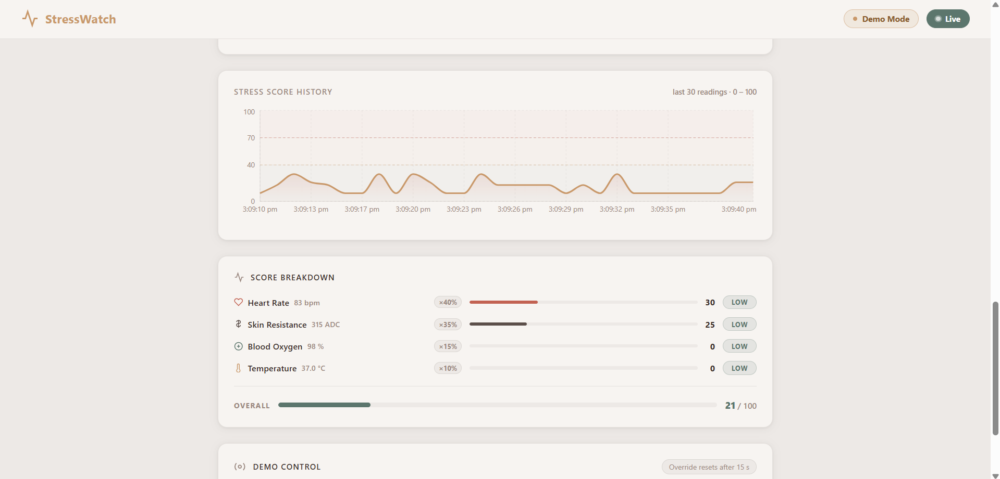
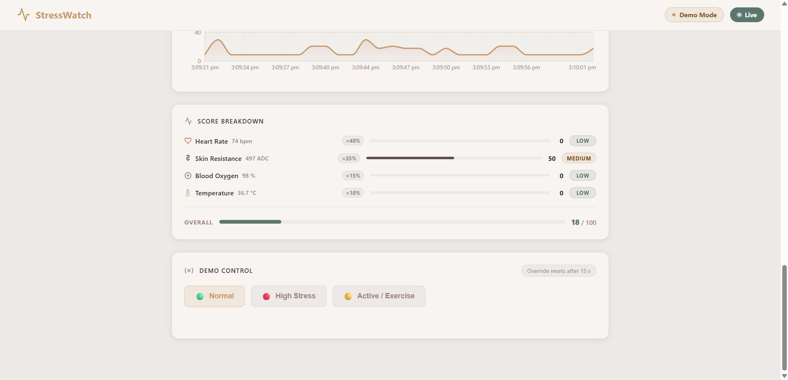

# 🩺 Health Monitoring System

A real-time health monitoring system that reads biometric data from wearable sensors, computes a stress score, and displays live vitals on a web dashboard.

---

## 📸 Overview

This project connects physical sensors (heart rate, SpO2, temperature, motion, GSR) to a full-stack web application via a Python bridge. Data is processed on the backend, stress is calculated in real time, and the frontend updates live over WebSockets.

---

## 🎥 Demo

### Hardware — Sensors & Serial Monitor

[](https://youtube.com/shorts/ZbYpkuElk0s)

> Arduino Nano wired with MAX30102 (HR + SpO2), TMP117 (temperature),
> MPU6050 (motion), and GSR sensor streaming live data over Bluetooth.
> Motion detection shown live — value spikes instantly on arm movement.

---

### Software — Live Dashboard

[](https://youtu.be/Y19A_cPrt-s)

> StressWatch dashboard showing live vitals, 30-reading history charts,
> score breakdown, and intelligent differentiation between stress vs
> active/exercise states using demo mode simulation.

---

## 🖥️ Dashboard

| Overview | Metric Cards & Charts |
|---|---|
|  |  |

| History Charts | Score Breakdown |
|---|---|
|  |  |



---

## 🔧 Hardware

| Bluetooth Module | Arduino Nano |
|---|---|
|  |  |

| Battery Charger | Full Prototype |
|---|---|
|  |  |

---

## 🏗️ Architecture

```
Arduino Sensors
    ↓  (Serial / Bluetooth JSON)
bridge.py  ──── fallback: fake_band.py
    ↓  (HTTP POST)
Node.js Backend  →  MongoDB
    ↓  (Socket.IO)
React Frontend
```

---

## ✅ Features (V1)

- 📡 **Live sensor data** from Arduino over USB/Bluetooth
- 🔁 **Demo fallback** — bridge auto-switches to simulated data if hardware is unavailable
- 🧠 **Stress scoring engine** — calculates stress from HR, GSR, SpO2, and temperature
- 💾 **MongoDB persistence** — every reading is saved
- ⚡ **Real-time updates** via Socket.IO — no page refresh needed
- 📊 **Live charts** — last 30 readings for HR, SpO2, temperature, and stress history
- 🎛️ **Demo mode controls** — simulate NORMAL / STRESS / ACTIVE states from the UI

---

## 🧰 Tech Stack

| Layer | Technology |
|---|---|
| Frontend | React 18, Vite, Recharts, Socket.IO Client |
| Backend | Node.js, Express 5, Socket.IO, Mongoose |
| Database | MongoDB |
| Bridge | Python 3, pyserial, requests |
| Firmware | Arduino C++, MAX30105, TMP117, MPU6050 |

---

## 🔌 Hardware Components

| Component | Purpose |
|---|---|
| Arduino Nano | Main microcontroller |
| MAX30102 | Heart rate + SpO2 |
| TMP117 | Body temperature |
| MPU6050 | Motion detection |
| GSR (A0) | Galvanic skin response (stress indicator) |
| HC-05 | Bluetooth data transmission |
| TP4056 | Li-ion battery charging (USB-C) |

---

## 📁 Project Structure

```
health-monitoring-system/
├── arduino/
│   └── stress/
│       └── stress.ino          # Firmware — reads sensors, emits JSON via Serial
├── bridge/
│   ├── bridge.py               # Reads serial data, validates, POSTs to backend
│   └── fake_band.py            # Simulated sensor data generator
├── backend/
│   ├── server.js               # Express + Socket.IO server
│   ├── models/
│   │   └── Reading.js          # Mongoose schema
│   └── package.json
├── frontend/
│   ├── src/
│   │   ├── App.jsx             # Root component, socket connection, state
│   │   └── components/
│   │       ├── Header.jsx
│   │       ├── ModeBanner.jsx
│   │       ├── StressHero.jsx
│   │       ├── MetricCards.jsx
│   │       ├── SensorChart.jsx
│   │       ├── StressHistoryChart.jsx
│   │       ├── StressBreakdown.jsx
│   │       ├── DemoControl.jsx
│   │       └── Toast.jsx
│   └── package.json
├── docs/
│   └── V1.0.0/
│       ├── hardware/           # Hardware photos
│       ├── software/           # Dashboard screenshots
│       ├── v1-demo-hardware-health-monitoring.mp4
│       └── v1-demo-software-health-monitoring.mp4
└── package.json
```

---

## 🚀 Getting Started

### Prerequisites

- Node.js v18+
- Python 3.8+
- MongoDB (local or Atlas)
- Arduino IDE (for firmware upload)

---

### 1. Clone the repository

```bash
git clone https://github.com/Gourav-Chouhan-IT/health-monitoring-system.git
cd health-monitoring-system
```

---

### 2. Backend setup

```bash
cd backend
npm install
```

Create a `.env` file in the `backend/` folder:

```env
MONGO_URI=mongodb://localhost:27017/healthmonitor
PORT=5000
```

Start the backend:

```bash
npm start
```

---

### 3. Frontend setup

```bash
cd frontend
npm install
```

Create a `.env` file in the `frontend/` folder:

```env
VITE_BACKEND_URL=http://localhost:5000
```

Start the frontend:

```bash
npm run dev
```

---

### 4. Bridge setup

```bash
cd bridge
pip install pyserial requests
```

With Arduino connected:

```bash
python bridge.py
```

Without hardware (simulation mode):

```bash
python fake_band.py
```

---

### 5. Arduino firmware

1. Open `arduino/stress/stress.ino` in Arduino IDE
2. Install required libraries:
   - `MAX30105` by SparkFun
   - `SparkFun TMP117`
   - `MPU6050` by Electronic Cats
3. Upload to your Arduino board

---

## 🧠 Stress Scoring Logic

The backend calculates a stress score (0–100) from four inputs:

| Metric | Low Stress | Medium | High Stress |
|---|---|---|---|
| Heart Rate | 60–79 bpm | 80–109 bpm | 110+ bpm |
| GSR | < 200 | 200–599 | 600+ |
| SpO2 | ≥ 97% | 94–96% | < 90% |
| Temperature | 36.1–37.2°C | 37.3–38.0°C | > 38.0°C |

- **Motion modifier** — `Active` movement reduces score by 30% to account for exercise
- **Final label** — `Low` (< 40) · `Medium` (40–69) · `High` (≥ 70)

---

## 🎛️ Demo Mode

No hardware? Use the **Demo Controls** panel in the UI to simulate scenarios:

| Mode | Simulates |
|---|---|
| `NORMAL` | Resting, healthy vitals |
| `STRESS` | High HR, inactive, elevated GSR |
| `ACTIVE` | Elevated HR, active movement |

Demo overrides auto-reset to `NORMAL` after 15 seconds.

---

## 🌐 API Endpoints

| Method | Endpoint | Description |
|---|---|---|
| `POST` | `/api/data` | Receive raw sensor payload from bridge |
| `POST` | `/api/control` | Set demo mode override |
| `GET` | `/api/readings?limit=N` | Fetch last N saved readings |

---

## 📡 Arduino Serial Output Format

```json
{
  "hr": 72,
  "spo2": 98,
  "temp": 36.7,
  "gsr": 421,
  "motion_value": 12,
  "movement": "MOVED"
}
```

---

## ⚠️ Known Limitations (V1)

- SpO2 reading from Arduino is a fixed estimate — full MAX30102 SpO2 algorithm not yet implemented
- Frontend sensor history is in-memory only — clears on page refresh
- `GET /api/readings` exists but frontend does not load history on startup
- No authentication (login page is a placeholder)
- Serial port is hardcoded to `COM6` in `bridge.py`

---

## 🗺️ Roadmap

### V2 — Page 1: History / Analytics

- [ ] Sensor charts (HR, SpO2, Temperature) over time using saved readings
- [ ] Stress level timeline
- [ ] Filter by last 1 hr / 6 hr / 24 hr / 7 days
- [ ] Wire up `GET /api/readings` which already exists in the backend

---

### V2 — Page 2: Login / Authentication

- [ ] JWT-based login and registration
- [ ] `bcryptjs` and `jsonwebtoken` are already installed in the backend
- [ ] Protected routes on frontend
- [ ] Per-user reading history in MongoDB

---

### V2 — Page 3: Settings

- [ ] Serial port selection from UI (instead of hardcoded `COM6`)
- [ ] Alert thresholds (e.g. notify if HR > 110 or stress is High)
- [ ] Temperature unit toggle (°C / °F)
- [ ] User name and profile

---

### V2 — Page 4: Alerts / Event Log

- [ ] Auto-log entry every time stress level hits `High`
- [ ] Filterable list of past stress events with timestamps
- [ ] Severity indicators per event
- [ ] Exportable log

---

### V2 — Page 5: AI Insights ⭐

- [ ] User clicks "Analyze" and gets a plain English health summary
- [ ] Pattern detection — e.g. "Your stress peaks between 5–7 PM"
- [ ] Powered by Claude API
- [ ] Requires history data and login to be meaningful

---

## 📄 License

MIT License — feel free to use and modify.

---

## 👤 Author

**Gourav Chouhan**
[GitHub](https://github.com/Gourav-Chouhan-IT)
